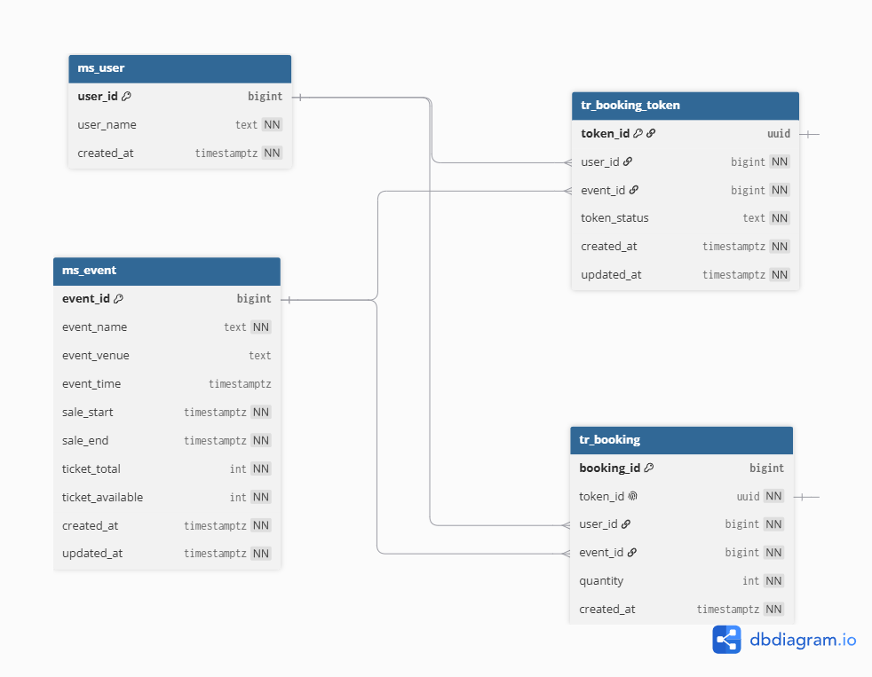

Terdapat empat tabel untuk project ini. Semua tabel menggunakan created_at untuk kemudahan developer. Beberapa menggunakan updated_at karena di tabel ms_user dan tr_booking tidak dimungkinkan untuk mengubah record.

### ms_user

Tabel user dibuat sesederhana mungkin untuk melakukan semacam login hanya menggunakan user_name. 

| Column     | Type        | Constraints             | Description                |
|------------|-------------|-------------------------|----------------------------|
| user_id    | BIGINT      | PK, generated identity  |                            |
| user_name  | TEXT        | NOT NULL, UNIQUE        | Readable human indentifier |
| created_at | TIMESTAMPTZ | NOT NULL, default now() |                            |

### ms_event

Master tabel untuk event. Terdapat data untuk sale_start, sale_end, ticket_total, dan ticket_available. Kolom event_rate_persecond untuk config rate limiter. 

| Column               | Type        | Constraints                          | Description                                   |
|----------------------|-------------|--------------------------------------|-----------------------------------------------|
| event_id             | BIGINT      | PK, generated identity               |                                               |
| event_name           | TEXT        | NOT NULL                             | kelengkapan event                             |
| event_venue          | TEXT        |                                      | kelengkapan event                             |
| event_time           | TIMESTAMPTZ |                                      | kelengkapan event                             |
| sale_start           | TIMESTAMPTZ | NOT NULL                             | kapan tiket bisa dijual                       |
| sale_end             | TIMESTAMPTZ | NOT NULL                             | kapan tiket tidak dijual lagi                 |
| ticket_total         | INT         | NOT NULL                             | berapa tiket yang ada                         |
| ticket_available     | INT         | NOT NULL, CHECK >= 0, CHECK <= total | berapa tiket yang tersedia                    |
| event_rate_persecond | INT         | NOT NULL, default 100                | config untuk rate per event (memudahkan test) |
| created_at           | TIMESTAMPTZ | NOT NULL, default now()              |                                               |
| updated_at           | TIMESTAMPTZ | NOT NULL, default now()              |                                               |

### tr_booking_token

Tabel untuk menyimpan booking token. Terhubung dengan user_id dan event_id. Setiap user_id dan event_id dapat memiliki banyak token_id.

| Column       | Type        | Constraints                       | Description                                                   |
|--------------|-------------|-----------------------------------|---------------------------------------------------------------|
| token_id     | UUID        | PK (application-generated)        |                                                               |
| user_id      | BIGINT      | NOT NULL, FK -> ms_user           |                                                               |
| event_id     | BIGINT      | NOT NULL, FK -> ms_event          |                                                               |
| token_status | TEXT        | NOT NULL, CHECK IN (ISSUED, USED) | flag untuk mengetahui apakah token sudah digunakan atau belum |
| created_at   | TIMESTAMPTZ | NOT NULL, default now()           |                                                               |
| updated_at   | TIMESTAMPTZ | NOT NULL, default now()           |                                                               |

### tr_booking

Tabel untuk menyimpan booking yang sudah dilakukan user. Hanya disimpan jika transaksi dan validasi berhasil.

| Column     | Type        | Constraints                              | Description                                               |
|------------|-------------|------------------------------------------|-----------------------------------------------------------|
| booking_id | BIGINT      | PK, generated identity                   |                                                           |
| token_id   | UUID        | NOT NULL, UNIQUE, FK -> tr_booking_token | karena UNIQUE setiap boking_id memiliki 1 atau 0 token_id |
| user_id    | BIGINT      | NOT NULL, FK -> ms_user                  |                                                           |
| event_id   | BIGINT      | NOT NULL, FK -> ms_event                 |                                                           |
| quantity   | INT         | NOT NULL, CHECK >= 1                     | jumlah berapa tiket yang dipesan oleh user                |
| created_at | TIMESTAMPTZ | NOT NULL, default now()                  |                                                           |

### ERD

