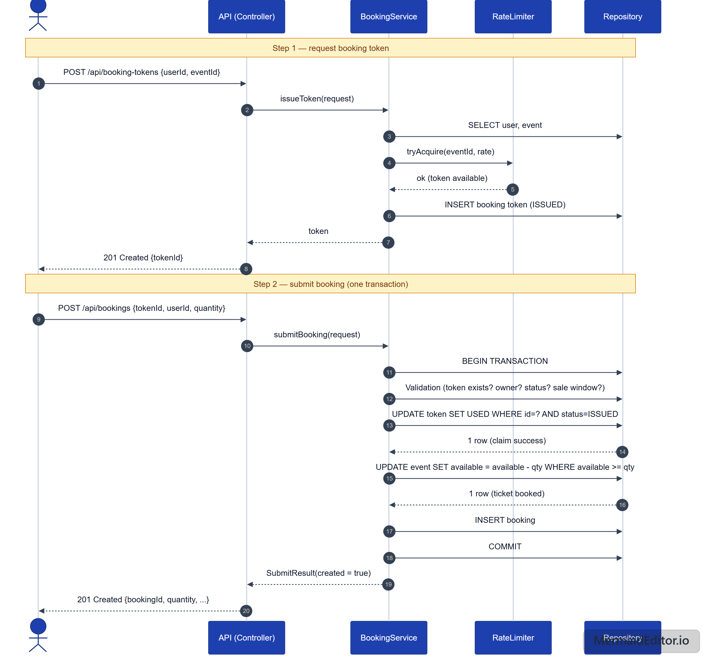

## Event Booking

API untuk booking event menggunakan springboot.
Fitur:
- Searching event
- Book event
    - Using booking token, untuk prevent double booking atau idempotent feature
    - Validasi dalam sql writing, atomic untuk mencegah race condition

### Concurrency

Feature yang digunakan:
1. Untuk race condition, atomic conditional update. Pada saat membaca stock dan menulis stock ada delay, ada kemungkinan untuk double booking. Maka digunakan conditional check saat mengurangi jumlah tiket yang dibooking dan claim token booking. 
```sql
UPDATE ms_event SET ticket_available = ticket_available - :qty
WHERE event_id = :id AND ticket_available >= :qty
```
```sql
UPDATE BookingToken t
            SET t.status = 'USED', t.updatedAt = :now
            WHERE t.id = :tokenId
              AND t.user.id = :userId
              AND t.status = 'ISSUED'
```
2. Untuk multiple book, idempotent using token. Submit dengan token yang sama akan di-response booking yang asli (replay).
3. Transaction untuk pengurangan tiket, sehingga jika tiket habis maka rollback issued token.  
4. Rate limiter solution, menggunakan bucket4j intervally refill pada issue booking token.


## Sequence Diagram



## Tech stack

- Java 21, Springboot 4.x (Web, Hibernate JPA)
- Maven (Wrapper)
- Bucket4j
- Testcontainer, Junit
- PostgreSql

## Requirement

| Requirement | Version    |                                          
|-------------|------------|
| JDK         | 21+        |                          
| Docker      | any recent | 

## Running Tests

Semua test ada di src/test

```
./mvnw test
./mvnw.cmd test
```

## Running Application

1. Run Database
```
docker compose up -d
```

2. Start Application
```
./mvnw spring-boot:run        
.\mvnw.cmd spring-boot:run
```

## Documentation

- [DB.md](DB.md) - database design: schema, ER diagram
- [Swagger](http://localhost:8080/swagger-ui/index.html) - API docs